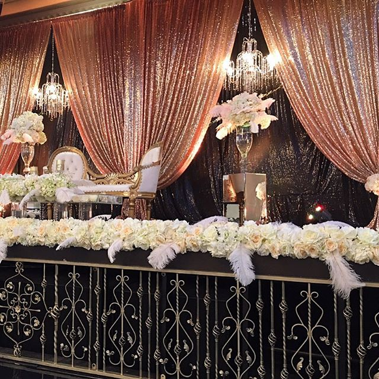
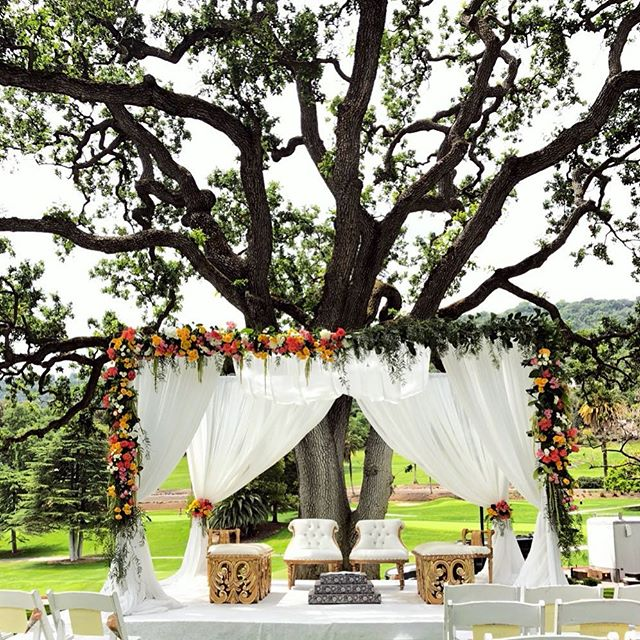
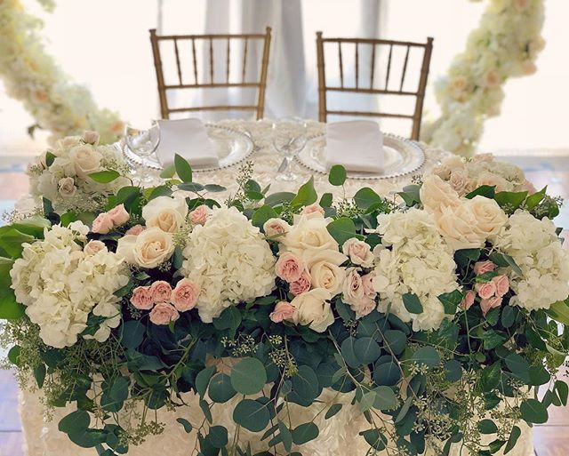
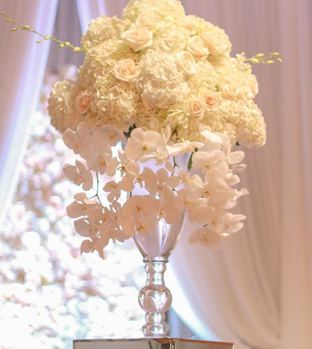

<nav>
  <a href="/" class="brand">Elegant Designs 

&nbsp; &amp; Decor</a>
  <input id="bmenu" type="checkbox" class="show"><label for="bmenu" class="burger toggle pseudo button">menu</label>
  

    <a href="#services" class="pseudo button" onclick='hideBurger()'>Services</a>
    <a href="#gallery" class="pseudo button" onclick='hideBurger()'>Gallery</a>
    <a href="#contact" class="pseudo button blackButton" onclick='hideBurger()'>Contact Us</a>
  

</nav>

<header class="hero">
  

      <h1 class='allura' style='color:white;'>Event Design, Event Planning, Floral Artistry</h1>

  

</header>

  

    Services
  

  <h2>Event Design</h2>
  
We work with you to select the perfect venue, determine the event design, and cast a talented team of vendors for your events. With years of experience, we have cultivated an in-depth knowledge of the event industry to help you transform your vision into a reality.

  <h2>Event Planning &amp; Coordination</h2>
  
Once the vision is set, we manage the details of vendor coordination and timelines to set the stage for a flawless event. We are with you behind the scenes on your day, keeping everyone on schedule, supervising the setup of your event, managing the vendors and corralling the guests so that everything is as cool and smooth as your first sip of champagne.

  <h2>Floral Artistry & Decor</h2>
  
With an amazing team of floral 
    designers, we help bring all your floral dreams come true. From the moment we help you select your arrangement style, you will be assured to have your vision come to life during your mock sample set-up.
    Something borrowed, something blue, and something created just for your event! Our custom handmade decor pieces are uniquely created per event for a timeless touch.

  Gallery

  
  <input id="tabC-1" type='radio' name='tabGroupC' checked >
  <input id="tabC-2" type='radio' name='tabGroupC'>
  <input id="tabC-3" type='radio' name='tabGroupC'>
  <input id="tabC-4" type='radio' name='tabGroupC'>
  <label for="tabC-1"></label>
  <label for="tabC-2"></label>
  <label for="tabC-3"></label>
  <label for="tabC-4"></label>
  

    

      
    

    

      
    

    

      
    

    

      
    

  

  Contact Us

<a class='small-device' href='https://goo.gl/forms/omAWZZYsXM2nqJLc2' target='_blank'> Click here to contact us!</a>

  <iframe class='large-device' src="https://docs.google.com/forms/d/e/1FAIpQLSdzkZqiPSz8dCOKx-Vy9uNaWUHtzEVRx5F7hhQbAnYkFH8I6Q/viewform?embedded=true" height="946" frameborder="0" marginheight="0" marginwidth="0" allowfullscreen width='600'>Loading...</iframe>

   

